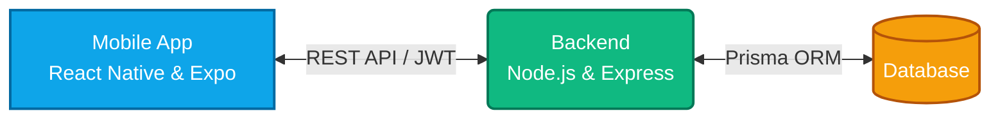
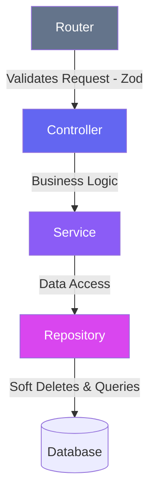

# 🏗️ ConstructPro

**A modern, robust full-stack solution built to show, not just tell, what I can do.**

ConstructPro is a comprehensive management application designed to handle complex relational data securely and efficiently. 

## 🚀 The Tech Stack (Why you should care)

**Backend:**
- **Node.js & Express:** Lightweight, fast, and scalable API.
- **TypeScript:** End-to-end type safety. No more guessing what an object looks like.
- **Prisma ORM:** Clean, type-safe database access with structured migrations.
- **Zod:** Battle-tested schema validation (because we don't trust user input).
- **JWT & Helmet:** Built with security in mind from day one.

**Mobile App:**
- **React Native & Expo:** True cross-platform development (iOS & Android).
- **Zustand:** Global state management that's simple, fast, and hook-based (no Redux boilerplate here).
- **NativeWind (Tailwind):** Utility-first styling for beautiful, consistent UI components.
- **React Navigation (v7):** Smooth, native-feeling transitions and routing.

## 💡 Architecture & Highlights

### System Overview

### Backend Data Flow (Clean Architecture)

- **Soft Deletes Everywhere:** You asked, and yes! The entire database architecture uses soft deletes (`deletedAt`). Data is never truly lost, maintaining referential integrity across projects, workers, payments, and expenses.
- **Clean Code & Repositories:** The backend separates concerns using the Repository and Service patterns. Controllers stay thin, and business logic stays testable.
- **Offline-Ready Patterns:** The mobile app leverages SecureStore and SQLite for efficient local data handling where necessary.

## 🏃‍♂️ Getting Started

1. **Backend:** `cd backend && npm install && npm run dev`
2. **Mobile:** `cd mobile && npm install && npm start`

*Built by a developer who cares about performance, maintainability, and shipping great products.*
